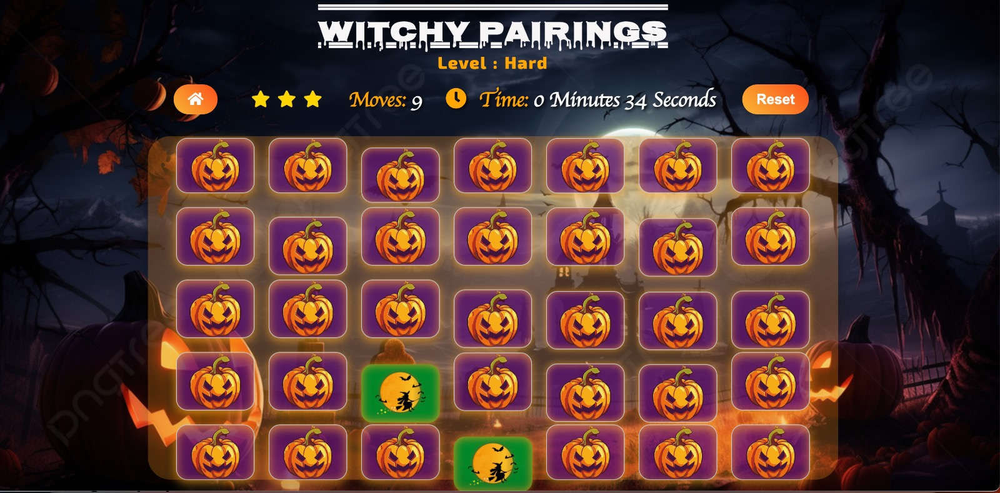

# 8710 Project - Foundations of Software Engineering 
# Witchy Pairings

[Link to Live Website](https://witchy-pairings.netlify.app)

[GitHub Repo](https://github.com/sejal-bansal/8710-project-game) 

[Game Reflection](https://github.com/sejal-bansal/8710-project-game/tree/master/reflection) 

## Index – Table of Contents 

* [About](#About)
* [Game Layout](#Game-Layout) 
* [Logic](#Game-Logic)
* [User Stories](#user-stories)
* [Features](#features) 
* [Technologies Used](#technologies-used) 
* [Deployment](#testing) 
* [Acknowledgements](#credits)
* [Authors](#authors)
  

## About   

This is a simple Memory Game Web Application based on Halloween theme called "Witchy Pairings", created as part of our Foundations of Software Engineering coursework. The game is designed to test a user's memory and is made up of a deck of cards, each card containing an image assigned randomly. The goal is to click on a card to reveal the image behind it, memorise the card containing that image and match cards with similar images until all the pairs are matched.

   

## Challenge
 
 The challenge is to match all the cards in as little time as possible, making the fewest selections possible

*** 

## Instructions
* Click on the level of your choice (Easy, Medium, Hard) to start the game.

* Click on the blocks to reveal the image behind it. Do it to the remaining blocks and find the matching pair.

* Continue revealing cards and working your memory to remember each unveiled card.

* Match cards properly with less moves and in faster time.

* You can reset the game using “Reset” button.

* Check the time with the help of “Timer” at the top of the game.

* You can go to the home page with the help of home button.

***

## Game Layout

The index page is made up of a modal that contains instructions on how to play the game, and a Start Game button taking the user to the game page. The user can also click on the level of their choice and play the game. The Start Game button takes users to the default Easy level of the game. The The game is made up of a single page containing a header, a score panel that keeps tabs of performance indicators such as the time, the number of moves and the current star rating of the user, depending on the performance, and also contains the reset button.

The game board is made up of a deck division containing cards based on the level, which were created dynamically in javascript. Each card consists of a front face and a backface. On card hover, the card background lightens up, and on card click, the card flips 180 degrees and reveals the image behind it, which the user then needs to memorise to improve performance. 

   

<!-- The primary colours used in my palette were three shades of green (Emerald, Green Pantone, and lincoln green), two shades of yellow/orange (Orange web & Gold Web) for contrast, on a green & black vector background customized on svgbackgrounds.com. The cards have an image of a vector cartoon animal to convey a more "game" feel, as well as careful choice of multi-coloured vector icons on the backface of the cards to ensure colour diversity while maintaining a tri-coloured theme.  -->

<!-- 

   

 -->

A "Win-Game" Modal appears in the center of the screen upon completion of the game, providing feedback concerning grade, star rating and time taken to complete the game.

The deck of cards was designed using CSS grid, in order to ensure responsiveness.

Fonts used were Exo 2 and quicksand as they are very readable and game-friendly, conveying a slight comical feel which is appropriate to the goal of the game.

***

<!-- ## Game Requirements

* On load or restart, the cards must be shuffled and a random array of images is to be generated.

* The game needs to be able to handle both matched and unmatched cards.

* Cards need to make a sound when flipped, a success sound when they match, an error sound when unmatched and a victory sound when game is completed.

* Cards must not be clickable when they are already open.

* Game should be able to display the number of moves or clicks a user has made.

* Game must display a timer that starts when the first click is made, and ends when the last pair of cards has been matched.

* Game should be able to display a star rating that indicates a user's performance, based on the number of moves made.

* The more moves a user makes, the user rating decreases. 

* A reset button that shuffles the images array, resets timer and star rating, and reassigns those reshuffled images to the cards.

* A win game modal displayed when the game is completed to congratulate the user.

* Win Game modal is updated with user's game stats and displayed at the end of the game to provide feedback. 

* Win game modal needs to have the option to ask the user to play again.

*** -->
 
## Game Logic 

* An array that stores the image paths, which will be assigned to the cards and displayed on their backfaces.

* An array that stores opened cards and an array that stores matched cards.

* Function that shuffles the images array when the game is loaded

* A function that initiates the game which invokes the shuffle function, assigns random image onto each individual card and appends cards to the deck.

* A timer function which is called in the card eventListener that updates the innerHTML every 1 second interval from the moment a card is clicked.

* A stopTime function that clears the time function interval.

* A reset function that resets all global variables and the content of HTML elements (timer, stars, moves, and their innerHTML) and empties all arrays.

* A movesCounter function that updates the number of moves made.

* A function that updates the star rating depending on the number of moves the player has made to complete the Game. 

* The number of starts will decrease the more moves a player makes. 

* A function that compares two cards in the openedCards array when its length is 2, and decides whether they're a match or a noMatch.

* If they match, they will be pushed to the matched cards array, otherwise they will be removed from the openedCards array.

* A function that fetches the player stats, and provides appropriate feedback based on the stats.

* A function that displays the win-game modal.

* A Win-game function that displays the win-game modal when game is completed, and calls the stats function and stoptimer function.

* A function that handles clicked cards, applies flip animation, plays audio, reveals backface and adds card content to openedCards array.

<!-- *** -->

## User Stories
As a user, I would like to:

* See a visually appealing, intuitive, challenging, fun game!
* I want to be rated based on my performance
* Click on any card as first card and clicked card should turn.
* Click any card as second card and clicked card should turn.
* Want to restart the game at any time.
* Want the game to be responsive so I can play on both mobile and desktop devices..
* The game to have a Halloween theme to match the title
* Get confirmation and performance feedback when the game is completed.
* Want to play at different difficulty levels.
* See a main menu so that I can choose to start the game or view instructions

<!-- *** -->

## Features
### Existing features
#### Home
* Intuitve instructions modal.
* Call to action: Encourage the user to take action. In the case of the home page, start the game.

#### Game page
* Game cards: clickable, and turn on click.
* Game logic: in case there is a match, the cards animate and remain visible.
* Moves counter: after each move (when two cards turned) the counter updates.
* Game over modal.
* Congratulations header.
* Call to action: encourage the user to take action. In this case restart the game.
* Evaluation/feedback messages: depending on performance.
* Call to action: Encourage the user to take action. In this case to try again and beat your best score.
* Reset score: Restart the game again at any stage.

#### Features that can be implemented
* High all-time board: show all time statistics of all users.
* Auditory cues to assist memorisation.
* Timed mode: add a timer to make the game more challenging, i.e. finish game before timer runs out.

***

## Technologies Used
* HTML
* CSS
* Javascript
* Google Fonts
* Font Awesome Library
* Chrome Developer Tools
* Markup Validation Service
* CSS Validation Service
* JSHint for testing JS code
* Am I responsive
* Gitpod.io - for writing the code. Using the command line for committing and pushing to GitHub 
* GitHub - Used to host repository  
* GIT - for version control of the project. 

***

### Responsiveness

As a backup to using Chrome developer tools to check for responsiveness across multiple devices, I have also used http://ami.responsivedesign.is and was very pleased with the outcome, and the game layout across various screen sizes. -->

   

<!-- *** -->

## Setup Instructions for Local:
* Clone the repository
Git clone git@github.com:sejal-bansal/8710-project-game.git
* Change your current directory to the game's directory.
* Open the index.html file using a web browser to play the game locally.

## Deployment

### Netlify

To publish the website:

* Install netlify using cli
* Enter the command netlify login on terminal
* It will take you to the netlify account, login using your github credentials
* Select the repository to be deployed
* Click on Deploy Site, Netlify will then pull the latest code from the selected branch and deploy it 
* After deployment, a unique Netlify URL will be provided, such as https://witchy-pairings.netlify.app/.
* Click on the link to access the deployed game 

## Credits

* [W3C schools](https://www.w3schools.com/)
* [Mozilla Developer Networks](https://developer.mozilla.org/en-US/)
* [Flaticon.com](https://www.flaticon.com/) for the all images used in the project
* Kris DeBruine Media - [How to shuffle an array](https://www.youtube.com/watch?v=79AWYPyPEdU)
* Adam Khoury - [Visualising the Fisher-Yates shuffle method](https://www.youtube.com/watch?v=tLxBwSL3lPQ&t=423s)
* FreeCodeCamp.org for tutorials regarding breaking down Memory game logic
* [Sandra Israel's Memory game process for inspiration](https://scotch.io/tutorials/how-to-build-a-memory-matching-game-in-javascript#toc-what-is-the-memory-game) 
* Flip Cards based on [W3C flip card tutorial](https://www.w3schools.com/howto/howto_css_flip_card.asp)
* [SVG Backgrounds](https://www.svgbackgrounds.com/) for free customisable SVG Backgrounds.
* [CSS gradient generator](https://cssgradient.io/)
* [Game reference](https://github.com/motazabdou/MS2-MemoryGame)

<!-- ## Reflection:
Creating the Matching Blocks game was a challenging yet rewarding experience that provided valuable insights into the world of game design and development. Throughout the process, I encountered various challenges, discovered what worked effectively, identified areas for improvement, and gained essential lessons that significantly enhanced my skills and understanding of game development.
We managed our project using Agile methodology. Since not all team members are in the same physical location, we first established several channels of communications. Most of our meetings were dedicated to choosing the project and discussing design changes for the memory game we selected. 
We used to have our stand up meetings every Monday at 6:00pm, where we discussed the progress of the game, the tasks assigned, any blocker issues, etc.

## Challenges faced:
* Selecting a game which is both easy to create and manage is our first challenge.
* Balancing complexity and simplicity posed another challenge. Striking the right balance was crucial to ensure the game was easy to understand for players while offering a satisfying level of challenge.
* We all live in different places which made it impossible to meet in-person and to discuss regularly.
* Technical challenges also emerged during the development process. Implementing smooth animations, responsive touch controls, and efficient collision detection required careful coding and constant iteration.
* Compatibility issues across different devices and operating systems demanded extensive testing and optimization, adding complexity to the development process.

## What worked:
* A key success factor was the iterative development approach. Starting with a basic prototype allowed for rapid experimentation and testing of various gameplay ideas. Feedback from playtesting sessions played a vital role in refining the mechanics and overall game experience. Iterative testing and feedback helped in identifying and rectifying issues early, ensuring a polished end product.
* Conducting regular zoom calls to discuss the ideas and to implement them made it easier for everyone to follow the flow. Documenting every stage of the project and creating user stories gave us clarity regarding the work which has been done.
* Additionally, establishing a clear art style and consistent visual design contributed significantly to the game's appeal. Creating visually appealing and cohesive graphics enhanced the overall player experience, making the game more engaging and immersive. The sound effects make the user feel the game while playing.

## What didn’t work:
* One of the notable challenges was managing scope. Initially, the project aimed for a wide range of features, but it became apparent that some elements needed to be scaled back or postponed to ensure a timely release.
* Learning to prioritize features and focus on the core gameplay mechanics would have streamlined the development process. 

## Lessons learned:
* The development of the Matching Blocks game taught me several valuable lessons. Firstly, the importance of simplicity cannot be overstated. A straightforward and intuitive gameplay mechanic often leads to the most enjoyable games. Complexity should arise from mastering simple rules, providing depth without overwhelming players.
* Effective planning and prioritization are essential. Establishing a clear roadmap, setting achievable milestones, and regularly reevaluating the project's scope are crucial for successful development. Moreover, incorporating player feedback early and often significantly improves the game. Players provide valuable insights that are vital for refining gameplay and addressing potential issues.
* Lastly, the significance of adaptability and resilience cannot be overlooked. Unexpected challenges will inevitably arise during the development process. Adapting to unforeseen circumstances, being open to feedback, and embracing a willingness to iterate and improve are fundamental qualities that contribute to a successful game development journey.
 -->

## Authors
* [Sejal Bansal](https://github.com/sejal-bansal)
* [Carolina Liskey](https://github.com/carolinaliskey)
* [Varshitha Bonguluru](https://github.com/Varshitha01)
